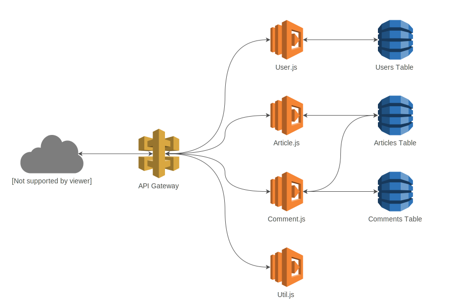

# 

[](http://realworld.io)
[](https://travis-ci.org/anishkny/realworld-dynamodb-lambda)
[](https://coveralls.io/github/anishkny/realworld-dynamodb-lambda?branch=master)
[](https://greenkeeper.io/)
[](https://snyk.io/test/github/anishkny/realworld-dynamodb-lambda)
[](https://gitter.im/realworld-dev/node-lambda-dynamodb)

> ### AWS DynamoDB + Lambda codebase containing real world examples (CRUD, auth, advanced patterns, etc) that adheres to the [RealWorld](https://github.com/gothinkster/realworld-example-apps) spec and API.


### [Demo](https://anishkny.github.io/realworld-dynamodb-lambda/test-output/network.html)

This codebase was created to demonstrate a fully fledged fullstack application built with **AWS DynamoDB + Lambda** including CRUD operations, authentication, routing, pagination, and more.

We've gone to great lengths to adhere to the **AWS DynamoDB + Lambda** community styleguides & best practices.

For more information on how to this works with other frontends/backends, head over to the [RealWorld](https://github.com/gothinkster/realworld) repo.

# Getting started

*Requires Node 8 or higher*

Clone this repo, and cd into it:
```
git clone https://github.com/anishkny/realworld-dynamodb-lambda
cd realworld-dynamodb-lambda
```

## Starting the local server

```
npm install
npm run start
```

This should start local DynamoDB emulator and Serverless offline. You can now make API calls against `http://localhost:3000/api` like this:

```
curl http://localhost:3000/api/articles

Serverless: GET /api/articles (λ: listArticles)
Serverless: The first request might take a few extra seconds
Serverless: [200] {"statusCode":200,"headers":{"Access-Control-Allow-Origin":"*","Access-Control-Allow-Credentials":true},"body":"{\"articles\":[]}"}
```

## Running tests locally
```
npm test
```
See sample test run [log](https://travis-ci.org/anishkny/realworld-dynamodb-lambda) and [network traffic](https://anishkny.github.io/realworld-dynamodb-lambda/test-output/network.html).

# How it works

## Overview
This repo uses [Serverless Framework](https://serverless.com) to describe, test and deploy the [RealWorld REST API](https://github.com/gothinkster/realworld/blob/master/api/README.md#endpoints) to [AWS Lambda](https://aws.amazon.com/lambda/). AWS Lambda provides "serverless" cloud functions as a service. [AWS API Gateway](https://aws.amazon.com/api-gateway/) is used to expose the deployed Lambda functions as a HTTP REST API.



## API
The API is described in the [`serverless.yml`](serverless.yml) file. For example the following snippet instructs AWS Lambda to execute the `create` method in [`src/User.js`](src/User.js) whenever a `POST` method is called on `/api/users`:
```
functions:

  ## Users API
  createUser:
    handler: src/User.create
    events:
      - http:
          method: POST
          path: /api/users
          cors: true

  ...
```

## Storage
For storage, [AWS DynamoDB](https://aws.amazon.com/dynamodb/) a managed serverless NoSQL database is used. Tables are created to store `users`, `articles` and `comments` also described in `serverless.yml` file. For example:
```
resources:
  Resources:

    UsersDynamoDBTable:
      Type: 'AWS::DynamoDB::Table'
      DeletionPolicy: Retain
      Properties:
        AttributeDefinitions:
        ...
```

## Deployment
To deploy the code to AWS, simply execute:
```
npm run deploy
```
This will use `serverless` to deploy the API as described in `serverless.yml`.

Once deployed, you can test the deployed API by executing:
```
npm run test:deployed
```
